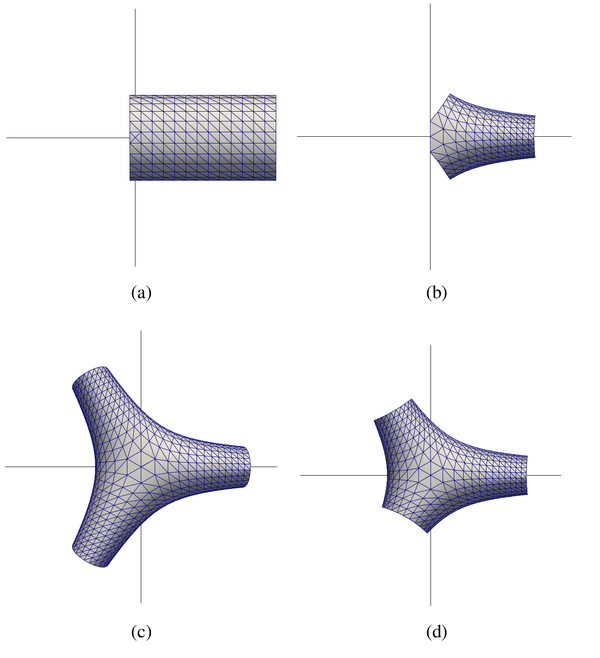
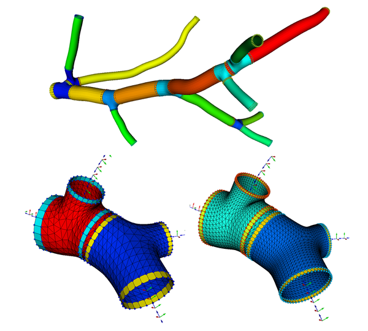
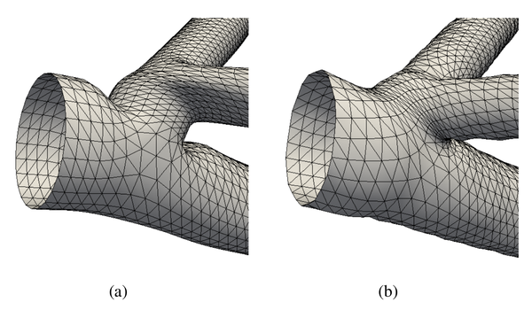

# VesselMesh3D-Conformal

This repository contains implementation of an automated algorithm for constructing the polygonal mesh of blood vessels from 3D computed tomography (CTA) or magnetic resonance (MRA) angiograms. Accurate modeling of the human vascular tree is required for visualization, diagnosis of vascular diseases, and computational fluid dynamic (CFD) blood flow simulations.

The proposed algorithm is based on the centerline-radius representation of vascular segments. Each vascular segment is modeled as a tubular object, and a thin plate spline transform is used to generate the corresponding surface. The challenge of modeling bifurcations is addressed with a novel approach based on conformal mapping.

For vessel centerline extraction, the algorithm employs a multi-scale Hessian-based vessel filter applied to 3D input images. The resulting vesselness image is thresholded and centerlines are initialized as a binary skeleton. All n-furcations of the skeleton are detected, and the skeleton is parsed to generate its nonfurcating segments. Spline interpolation is applied to each segment, generating points and corresponding tangent vectors. Blood vessel radii are estimated from image intensity profiles.

The centerline of each vessel is represented by a set of consecutive points with Cartesian coordinates, tangent vectors, and estimated mean radii. A base mesh of the vessel model is automatically generated by patching a structured grid with triangulated quadrilateral patches. The polygonal mesh is constructed using Bookstein's Thin Plate Spline (TPS) algorithm with source and target landmarks.

For bifurcations, each branch is modeled with a cylinder and transformed according to a conformal mapping (Figure 3). This mapping is expressed by a complex-valued function that transforms coordinates in a way that preserves angles. 
 
<table align="center">
  <tr><td align="center"></td></tr>
  <tr><td align="center"><i>Model construction of a planar bifurcation using conformal mapping. (a) Model of a branch and (b) branch after conformal mapping. Bifurcation model with 3 conformal branches of (c) equal and (d) different lengths.</i></td></tr>
</table>
 

The conformal branches are appended together to obtain a smooth and continuous geometrical model of the bifurcation. The polygonal mesh of the bifurcation is finally obtained using a TPS transform defined by appropriate source and target landmarks (Figure 4).
 

<table align="center">
  <tr><td align="center"></td></tr>
  <tr><td align
="center"><i>Polygonal mesh construction of a bifurcation from 3 connected vessels. (a) Bifurcation model and associated source landmarks, (b) corresponding target landmarks and (c) bifurcation mesh generated after TPS transform.</i></td></tr>
</table>
 

The model is improved by computing local intensity features with subvoxel accuracy to slightly deform the mesh. An iterative region-based deformable model moves vertices under the influence of external forces (attracting vertices toward vessel boundaries) and internal forces (Laplacian smoothing).

The algorithm was tested on a 3D synthetic image containing connected cylinders of different diameters and a 3D Time of Flight MR brain angiogram. Polygonal meshes of tubular segments and bifurcations were automatically generated, resulting in triangulated meshes with varying resolutions (Figure 6).
 
<table align="center">
  <tr><td align="center"></td></tr>
  <tr><td align="center"><i>Polygonal meshes generated from the 3D synthetic image. Top: vessel tree; Bottom: example of bifurcations, generated with N = 24 (left) and N = 48 (right).</i></td></tr>
</table>
 

The model was further improved through mesh optimization, fitting to actual image intensity by computing local features with subvoxel accuracy (Figure 8).
 
<table align="center">
  <tr><td align="center"></td></tr>
  <tr><td align="center"><i>Polygonal mesh optimization. Mesh of bifurcating vessels generated from the 3D synthetic image: (a) before and (b) after optimization.</i></td></tr>
</table>
 

Results demonstrate that the methodology is consistent and capable of generating high quality triangulated meshes of vascular trees suitable for CFD simulations. Compared to common techniques, conformal mapping proved to be a simple and effective mathematical approach for polygonal mesh modeling of bifurcating vessels.

## Publication
1. Centerline-Radius Polygonal-Mesh Modeling of Bifurcated Blood Vessels in 3D Images using Conformal Mapping, C. Vinhais, M. Kociński, A. Materka, SPA 2018, Signal Processing Algorithms, Architectures, Arrangements, and Application, 19-21 September 2018, Poznan, Poland, IEEE Conference, ([link](https://doi.org/10.23919/SPA.2018.8563388))

