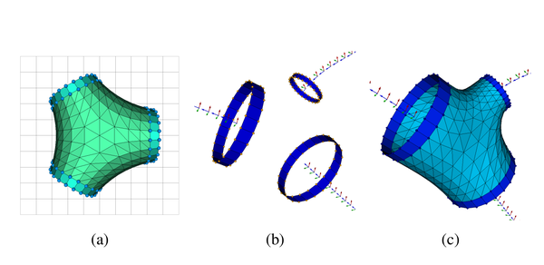

# VesselMesh3D-Conformal

This repository contains the implementation of an automated algorithm for constructing polygonal meshes of blood vessels from 3D medical images (CTA and MRA), with a novel approach for modeling bifurcations based on conformal mapping.
The algorithm models each vascular segment as a tubular object, using thin plate spline transforms to generate the corresponding surface from its centerline-radius representation. The innovation lies in the mathematical approach for generating polygonal meshes of bifurcating vessels through conformal mapping, which proved to be both simple and effective compared to common techniques.
The model is further refined by computing local intensity features with subvoxel accuracy to fine-tune the vascular tree mesh. The methodology was validated on both synthetic 3D images with randomly generated vascular branches and real-world Time of Flight MRA data.
The implementation is capable of generating high-quality triangulated meshes of vascular trees suitable for computational fluid dynamic (CFD) simulations. Compared to existing techniques, the conformal mapping approach offers a more elegant mathematical solution for polygonal mesh modeling of bifurcating vessels.
 
<table align="center">
  <tr><td align="center></td></tr>
  <tr><td align="center"><i>Model construction of a planar bifurcation using conformal mapping. (a) Model of a branch and (b) branch after conformal mapping. Bifurcation model with 3 conformal branches of (c) equal and (d) different lengths.</i></td></tr>
</table>
 

 
<table align="center">
  <tr><td align="center></td></tr>
  <tr><td align
="center"><i>Polygonal mesh construction of a bifurcation from 3 connected vessels. (a) Bifurcation model and associated source landmarks, (b) corresponding target landmarks and (c) bifurcation mesh generated after TPS transform.</i></td></tr>
</table>
 

 
<table align="center">
  <tr><td align="center></td></tr>
  <tr><td align="center"><i>Polygonal meshes generated from the 3D synthetic image. Top: vessel tree; Bottom: example of bifurcations, generated with N = 24 (left) and N = 48 (right).</i></td></tr>
</table>
 

 
<table align="center">
  <tr><td align="center></td></tr>
  <tr><td align="center"><i>Polygonal mesh optimization. Mesh of bifurcating vessels generated from the 3D synthetic image: (a) before and (b) after optimization.</i></td></tr>
</table>
 
